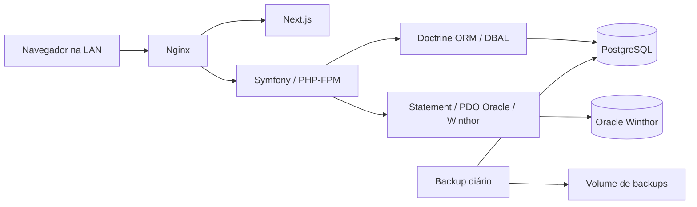

# Arquitetura

## Componentes



O navegador usa a mesma origem para frontend e API. Dockerfiles ficam em `backend/docker/` e `frontend/docker/`; o Compose usa os respectivos
projetos como contextos de build. O Nginx encaminha `/api/`
para Symfony e as páginas para Next.js. Não há CORS nem token de acesso em localStorage.
Sessões ficam em volume persistente do backend; cookies são HttpOnly e SameSite Strict.

## Padrões e responsabilidades

- `Controller`: rotas, autorização, entrada HTTP e resposta JSON.
- `Entity` / `Repository`: modelo persistente e acesso aos dados via Doctrine.
- `Service`: casos de uso, validação e transações. Controllers não calculam comissões.
- `Integration/Winthor`: portas e adaptadores para consultas Oracle preparadas e read-only.
- `EventListener`: proteção de sessão, CSRF e respostas de erro.
- `EventListener/Logs`: listeners de request, response, exception, consultas e auditoria; processors de correlação e remoção de dados sensíveis.
- `Exception`: erros de negócio com mensagens e códigos HTTP previsíveis.
- `Database/Connection`, `Database/Statement`, `Database/Event`: camada PDO externa com `DatabaseConnection`, `Query`, `Statement`, `Result`, `Transaction` e `DatabaseQueryEvent`.
- `Database/Doctrine`: middleware DBAL que despacha o mesmo evento para PostgreSQL.

`OrderGatewayInterface` desacopla a importação da implementação PDO e permite testar
sem acesso ao Winthor. `PaymentGateway` usa `Repository/Winthor/PclancRepository`
para consultar PCLANC, parametrizando RECNUM; cada registro é localizado pela chave primária.

## Persistência e consistência

`OrderSnapshot` guarda cabeçalho original, cliente, total e data de captura.
`OrderItem` mantém campos normalizados e a linha original completa. Importações
repetidas preservam o primeiro snapshot. Pedidos devem estar faturados (`POSICAO=F`).
A leitura de cabeçalho e itens ocorre na mesma transação Oracle read-only.

Uma comissão agrega pedidos do mesmo cliente principal (CODREVENDA), valor bruto, deduções, líquido,
autor e memória de cálculo. Cada pedido só pode participar de uma comissão.
Todos os débitos/devoluções/estornos pendentes do principal são deduzidos, como na baixa do legado.
A simulação verifica cancelamentos integrais usando a memória original; fonte e dedução são únicas e imutáveis. Valores usam decimal exato, sem cálculo financeiro com float.

Comissões seguem `pending → approved → paid`; pendentes ou aprovadas sem pagamento podem terminar em `rejected`, com justificativa e auditoria. O histórico financeiro permanece imutável: tabelas de vínculos arquivados preservam pedidos e deduções da comissão reprovada, permitindo liberar os vínculos ativos para reutilização. Qualquer usuário com perfil Financeiro pode aprovar, inclusive quem criou a comissão.
A confirmação registra data, valor integral, observação e autor. `RECNUM` é opcional
e pode ser associado uma vez, posteriormente. Uma transação não pode ser usada em
outra comissão. Isso não implementa rateio de pagamentos de várias comissões.

Transações e locks pessimistas protegem pedidos, deduções e mudanças de status.
Constraints do PostgreSQL reforçam valores, aprovação e unicidade. Triggers impedem
alteração/exclusão dos snapshots e eventos de auditoria. Alterações de schema devem
usar migrations; não execute `doctrine:schema:update --force`.

## Perfis

| Perfil | Responsabilidade |
| --- | --- |
| Operação | Importar pedidos, registrar deduções e comissões |
| Financeiro | Aprovar comissões, confirmar e vincular pagamentos |
| Auditoria | Consultar registros e trilha de auditoria |
| Administrador | Todas as funções, gestão de usuários e configuração versionada de cálculo |

Todos os usuários autenticados consultam pedidos, comissões, deduções e relatórios.
A trilha de auditoria é restrita a auditoria/admin. Desativação e alterações de perfis
passam a valer nas próximas requisições. A expiração por inatividade é de uma hora.

## Integração 749

`src/Repository/Winthor/PclancRepository.php` concentra a consulta PDO parametrizada:

```sql
SELECT L.* FROM PCLANC L WHERE L.RECNUM = :recnum
```

A consulta retorna um registro por `RECNUM` e valida a chave solicitada. Os detalhes encontrados ficam preservados em JSON no pagamento.
Nenhuma escrita é realizada no Oracle. Sem RECNUM, não há chamada a PCLANC nem
informações da 749 nos detalhes. `WINTHOR_749_LOOKUP_ENABLED=0` desativa a consulta e permite referência
manual, identificada como não consultada. Não há fallback silencioso em caso de falha
quando a consulta está habilitada.

A consulta comprova localização; validação automática de valor/beneficiário/baixa
exige mapeamento dos campos e regras financeiras com a equipe Winthor.

## Cálculo configurável

`CommissionRules` publica versões imutáveis de `CommissionRule`, apenas para ROLE_ADMIN.
A API exige a versão esperada para evitar alterações concorrentes. `CommissionCalculator`
usado tanto na simulação quanto na gravação soma QT × PVENDA, desconta a referência
escolhida e o frete configurado e aplica o percentual usando Brick\Math, sem floats.
Arredondamento half-up ocorre no bruto final; deduções são aplicadas depois.
Referências: pareamentos PSD/PSCF por filial e tabela do pedido, PCTABPR por região e PCPLPAG.NUMPR, PTABELA do item ou zero (base de venda).
Os preços/plano são preservados pelo `Repository/Winthor/OrderRepository` na importação.
Margens negativas de itens participam da soma; base ou líquido não positivos são rejeitados.
A comissão preserva a regra inteira, preço/quantidade/totais por item e frete.
Triggers impedem alteração de regras e valores/memória de comissões já gravadas.

## Exportações

`ReportExporter` usa o mesmo `ReportRepository::export` para PDF (Dompdf), XLSX
(OpenSpout) e CSV. Exportações exigem sessão, registram formato/período na auditoria,
são privadas e removem arquivos temporários depois do envio. CSV neutraliza fórmulas;
XLSX grava textos como strings e valores monetários como números. PDF tem logo DTS,
nome GCOM, período, paginação e limite de 1.000 comissões para proteger a memória.

## Logs capturados por eventos

Os listeners ficam em `src/EventListener/Logs` e usam `#[AsEventListener]`.
Request/response/exception usam eventos do kernel; auditoria usa `AuditRecordedEvent`.
A camada externa despacha `DatabaseQueryEvent` após consultas e controles de transação,
com SQL, duração em segundos, parâmetros e exceção opcional. O listener registra a forma
do SQL, contagem de parâmetros, duração em ms, conexão, operação e resultado; valores dos
parâmetros, literais, comentários, senhas e mensagens internas não são escritos.

Repositories Winthor chamam `Statement`, que encapsula PDO e retorna `Result`. `Transaction`
garante snapshot somente leitura no Oracle e rollback em falhas; `Result` materializa LOBs
antes do commit. A conexão externa é lazy para não exigir Oracle durante o boot da aplicação.
Doctrine continua responsável pelo PostgreSQL; seu middleware emite eventos para consultas
preparadas, comandos diretos, conexão, commit e rollback, incluindo falhas.

`CorrelationService` fornece o mesmo identificador para logs HTTP, SQL e auditoria; há um
identificador por requisição principal ou execução CLI. `LOG_REQUESTS`, `LOG_RESPONSES`,
`LOG_EXCEPTIONS` e `LOG_DATABASE` controlam os listeners operacionais. Desativar logging de
request preserva a geração de correlação. Auditoria financeira permanece obrigatória.
Monolog emite JSON nos streams stdout/stderr por canal (`requests`, `responses`, `exceptions`, `database_queries`, `audit`), usando a configuração de logs do daemon Docker. Não cria arquivos de log na aplicação. PHP-FPM não acrescenta prefixos às linhas JSON. Canais de mensageria ficam reservados; coleta Loki/OTel e métricas Prometheus ainda não são implantadas.

Veja a [matriz de consultas do legado](legacy-flow.md) para critérios de devolução, cancelamento e pendências de homologação.

Relatórios exportados mantêm um snapshot imutável dos dados PostgreSQL em `Entity/Report/ReportSnapshot`, salvo pelo respectivo repository na mesma transação do evento de exportação. Os formatos recebem esses dados preservados através do contexto de exportação; downloads do histórico não executam consultas de relatórios sobre as comissões atuais. As duas datas (preservação e geração do arquivo) são apresentadas no horário de Fortaleza.

A auditoria financeira utiliza `OrderGatewayInterface::inspect`, que lê o pedido, todos os itens e suas notas sem aplicar os filtros de elegibilidade para novas comissões. `CompareOrderSnapshotService` compara apenas dados preservados, ignora tabelas de preço auxiliares e normaliza diferenças de representação numérica. O resultado da conferência é registrado no histórico imutável de eventos, mantendo intactos snapshots, cálculo e pagamento.
